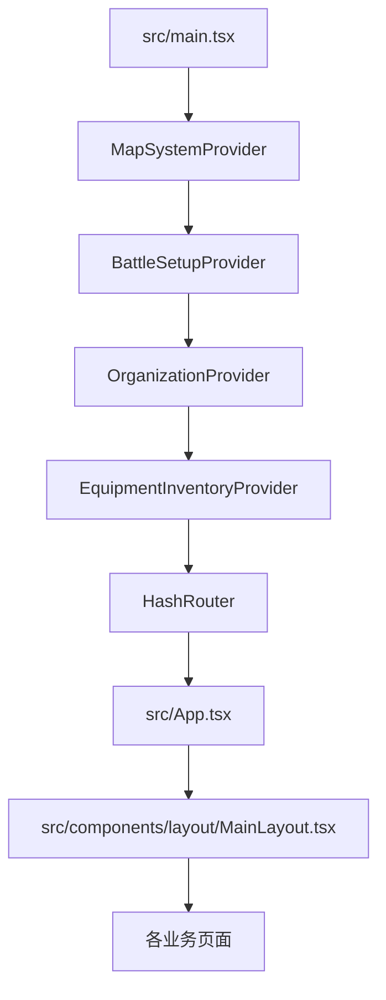
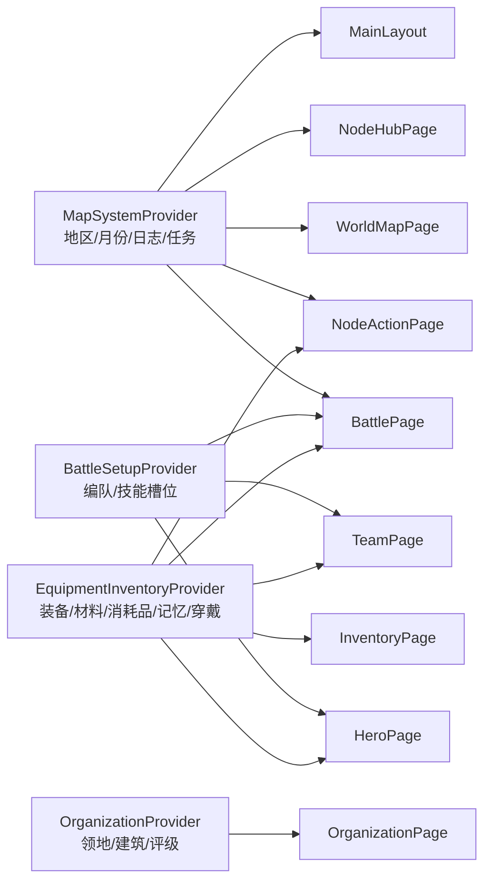
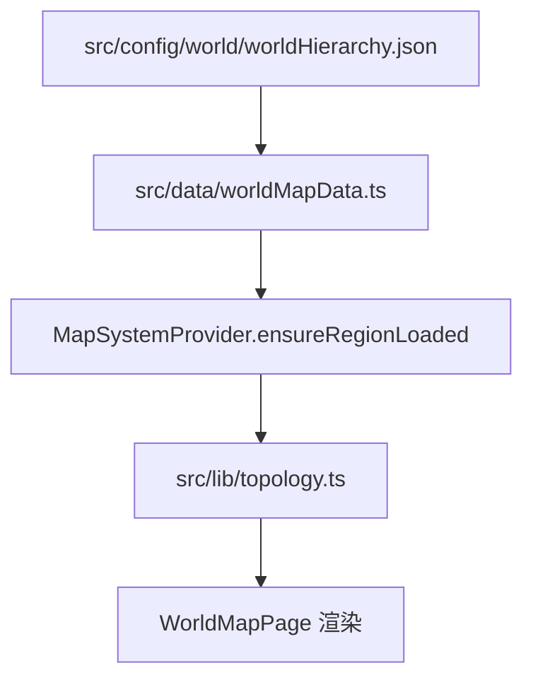
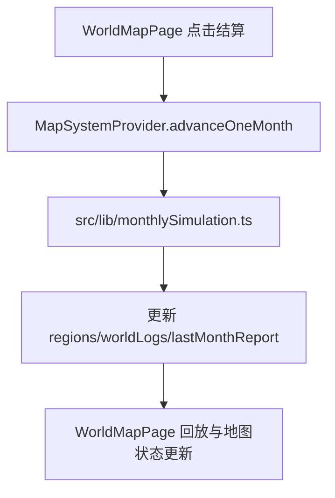
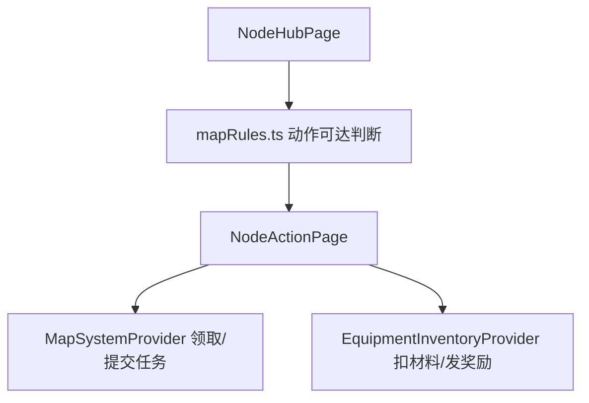
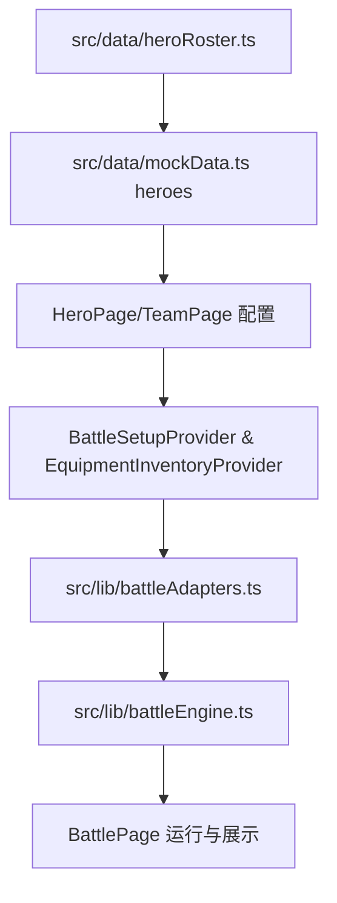
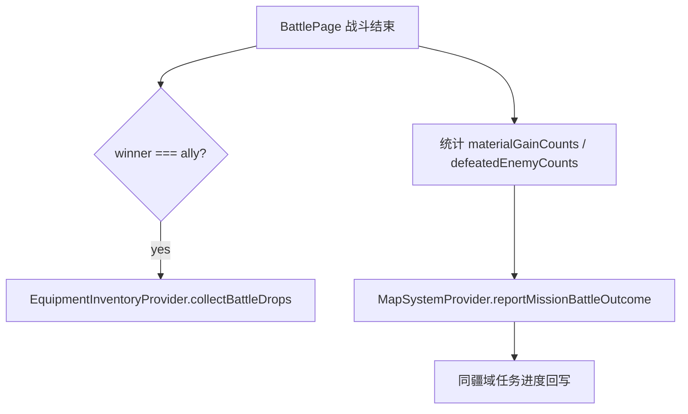
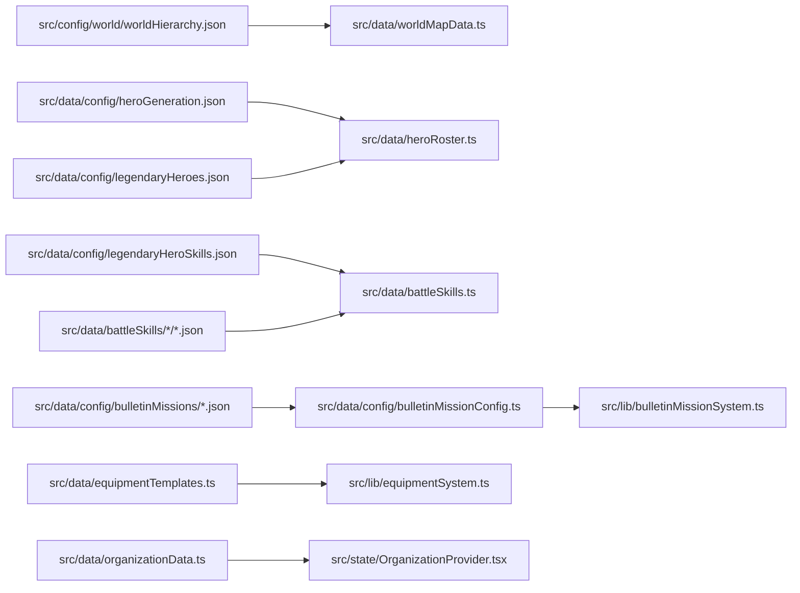

# 08. 架构总图与调用链图

本文件用于“快速建立全局心智模型”。看完后应该能回答三件事：

1. 入口从哪里进，页面怎么连。
2. 业务真相状态分别归谁管。
3. 主要链路的数据从哪里来、最后写回到哪里。

## 1. 启动与装配总图



关键点：

1. Provider 顺序固定，页面通过 hook 读取状态。
2. 页面只做展示与交互，不是业务真相存储层。

## 2. 路由总图

```mermaid
flowchart TD
  R0[/] --> R1[WorldMapPage]
  R0 --> R2[/node/:nodeId -> NodeHubPage]
  R0 --> R3[/node/:nodeId/:action -> NodeActionPage]
  R0 --> R4[/node/:nodeId/ritual -> RitualPage]
  R0 --> R5[/battle/:nodeId -> BattlePage]
  R0 --> R6[/team -> TeamPage]
  R0 --> R7[/organization -> OrganizationPage]
  R0 --> R8[/inventory -> InventoryPage]
  R0 --> R9[/hero/:heroId -> HeroPage]
```

关键点：

1. 地图与节点依赖 `nodeId`/URL 参数串联。
2. 英雄页页签依赖 `?tab=`。
3. 世界地图选择依赖 `continent`/`dominion`/`region`。

## 3. 状态归属总图



关键点：

1. 四个 Provider 各自有明确边界，不应新增平行业务状态副本。
2. `heroes` 不是 Provider 状态，来自 `src/data/mockData.ts` 的启动时常量。

## 4. 核心业务调用链总图

### 4.1 世界地图链路



### 4.2 月结算链路



### 4.3 节点与任务链路



### 4.4 英雄/队伍到战斗链路



### 4.5 战斗结果回写链路



## 5. 数据与配置入口图



## 6. 现阶段必须记住的架构限制

1. `heroes` 目前是静态常量，酒馆招募/动态英雄池不是页面小改动。
2. 世界地图当前 UI 只开放中央大陆入口，其他大陆在配置中存在但被入口限制。
3. 商店/商铺/酒馆/铁匠铺/仪式仍有占位实现，不要按“完整系统”假设开发。
4. 战斗技能配置同时影响 HeroPage 候选与 BattleEngine 运行，修改必须双向验证。

## 7. 按图定位改动入口

1. 想改流程：先看本文件链路图，再去对应模块文档。
2. 想改状态：先看“状态归属总图”，确认应该改哪个 Provider。
3. 想改参数：先看“数据与配置入口图”，确认是 JSON 配置还是 `lib` 常量。
